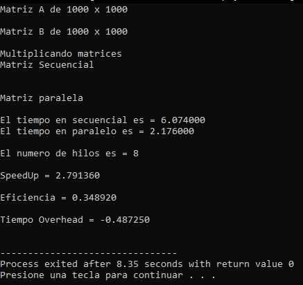
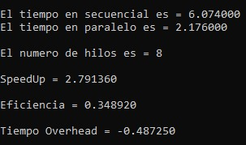

# Parallel Matrix Multiplication using OpenMP

## Description

This project implements sequential and parallel matrix multiplication in C using the OpenMP API.

Three dynamic matrices of size **1000 × 1000** are allocated and initialized with random values. The program performs matrix multiplication using both sequential and parallel approaches and compares their execution times.

The implementation also evaluates the performance of the parallel algorithm by calculating SpeedUp, Efficiency and Overhead.

---

## Features

- Dynamic memory allocation
- Sequential matrix multiplication
- Parallel matrix multiplication using OpenMP
- Random matrix generation
- Execution time measurement
- SpeedUp calculation
- Parallel efficiency calculation
- Overhead calculation

---

## Technologies

- C
- OpenMP
- Dynamic Memory Allocation
- Parallel Programming

---

## Matrix Size

| Matrix | Dimensions |
|---------|------------|
| Matrix A | 1000 × 1000 |
| Matrix B | 1000 × 1000 |
| Matrix C | 1000 × 1000 |

---

## Compilation

Compile using GCC with OpenMP support.

```bash
gcc parallel_matrix_multiplication.c -fopenmp -std=c11 -o matrix
```

Run

```bash
./matrix
```

---

## Performance Metrics

The program reports:

- Sequential execution time
- Parallel execution time
- Available processors
- SpeedUp
- Parallel Efficiency
- Overhead

---

## Algorithm

1. Allocate memory dynamically.
2. Generate two random matrices.
3. Multiply matrices sequentially.
4. Measure sequential execution time.
5. Multiply matrices using OpenMP.
6. Measure parallel execution time.
7. Calculate SpeedUp.
8. Calculate Efficiency.
9. Calculate Overhead.

---

## Example Output

```text
Matrix A de 1000 x 1000

Matrix B de 1000 x 1000

Multiplicando matrices

Matriz Secuencial

Matriz Paralela

El tiempo en secuencial es = 5.882000

El tiempo en paralelo es = 2.203000

El numero de hilos es = 8

SpeedUp = 2.669995

Eficiencia = 0.333749

Tiempo Overhead = -0.459875
```

---

## Screenshots

### Program Execution



---

### Performance Results



---

## Notes

The function responsible for printing matrices is included in the source code but remains disabled by default.

Printing a **1000 × 1000** matrix would generate one million values on screen, considerably increasing execution time and affecting the performance measurements. Therefore, the benchmark is performed without displaying the matrices.

---

## Concepts Demonstrated

- Parallel Programming
- OpenMP
- Matrix Multiplication
- Dynamic Memory Allocation
- High Performance Computing (HPC)
- Performance Evaluation
- SpeedUp
- Efficiency
- Overhead

---

## Possible Improvements

- User-defined matrix dimensions
- Block matrix multiplication
- Cache optimization
- SIMD vectorization
- GPU implementation using CUDA
- Performance visualization
- Parallel matrix initialization

---

## License

This project is licensed under the MIT License.

---

## Author

Jose Luis Alva Salazar

Computer Systems Engineering

GitHub: Luis Alva
